# Arquitectura: `6-agent-llamacpp-langfuse.py`

Agente de [Strands Agents](https://strandsagents.com) con un modelo servido por **llama.cpp** y observabilidad con **Langfuse**: cada pregunta genera un *trace* asociado a un usuario y a una sesión.

## Vista general

```mermaid
flowchart LR
    M[__main__] -->|ask&#40;pregunta, user_id, session_id&#41;| ASK[ask&#40;&#41;]
    ASK -->|abre observación raíz<br/>as_type=agent| LF[(Langfuse<br/>cloud o self-hosted)]
    ASK -->|propagate_attributes<br/>user, session, tags, metadata| LF
    ASK --> AG[Strands Agent]
    AG <-->|chat completions| L[llama.cpp 192.168.2.29:8080<br/>qwen3.8-27b]
    AG <--> T[Tools: calculator,<br/>current_time, letter_counter]
    AG -.spans OpenTelemetry<br/>llamadas al modelo y tools.-> LF
    ASK -->|root.update&#40;output&#41;| LF
    M -->|finally: flush&#40;&#41;| LF
```



## Componentes

| Componente | Rol |
|---|---|
| `load_dotenv()` | Carga `LANGFUSE_PUBLIC_KEY`, `LANGFUSE_SECRET_KEY`, `LANGFUSE_HOST` (y opcionales `APP_USER_ID`, `APP_VERSION`) desde `.env`. |
| `get_client()` + `auth_check()` | Obtiene el cliente singleton de Langfuse y valida credenciales al arrancar; si fallan, aborta con `RuntimeError` en lugar de perder trazas en silencio. |
| `letter_counter` | Tool custom (`@tool`). El docstring y los type hints forman el esquema que ve el modelo. |
| `calculator`, `current_time` | Tools de `strands_tools`. |
| `LlamaCppModel` | Cliente del servidor llama.cpp (`base_url`, `model_id`, parámetros de muestreo). |
| `Agent` | Bucle agéntico: el modelo pide tools, Strands las ejecuta y devuelve el resultado hasta la respuesta final. |
| `ask()` | Envuelve la llamada al agente en una observación de Langfuse y adjunta atributos de contexto. |

## Modelo de datos en Langfuse

| Concepto | Valor en este script | Para qué sirve |
|---|---|---|
| **Trace** | Una llamada a `ask()` | Unidad de análisis: entrada, salida, latencia, coste. |
| **Observación raíz** | `responder-consulta` (`as_type="agent"`), con `input=pregunta` y `output=respuesta` | Raíz del árbol; bajo ella cuelgan los spans del agente. |
| **Session** | `session_id = cli-<uuid>` (uno por ejecución) | Agrupa varios traces de una misma conversación. |
| **User** | `user_id` (`APP_USER_ID`, por defecto `mario`) | Filtrar y medir por usuario. |
| **Tags** | `["strands", "llamacpp"]` en la intención; ver nota abajo | Filtros rápidos en la UI. |
| **Metadata** | `model_id` y host | Contexto para comparar modelos/entornos. |
| **Version** | `APP_VERSION` (por defecto `0.1.0`) | Comparar versiones del código/prompt. |

## Flujo de una petición

1. `__main__` genera un `session_id` y llama a `ask(...)`.
2. `ask` abre `start_as_current_observation(as_type="agent", name="responder-consulta", input=pregunta)`. Esto crea el trace y el span raíz.
3. Dentro, `propagate_attributes(...)` fija `user_id`, `session_id`, `tags`, `metadata` y `version`; se propagan a las observaciones hijas creadas dentro del bloque.
4. `agent(pregunta)` ejecuta el bucle agéntico. Strands emite spans OpenTelemetry (llamadas al modelo, ejecución de tools) que quedan como hijos de la observación raíz, siempre que el SDK de Langfuse esté recibiendo los spans del proceso (ver "Puntos a verificar").
5. `root.update(output=respuesta)` registra la respuesta final.
6. En `finally`, `langfuse.flush()` fuerza el envío: Langfuse exporta en segundo plano por lotes y un script corto podría terminar antes de enviarlos.

## Configuración

`.env` en la carpeta del script:

```env
LANGFUSE_PUBLIC_KEY=pk-lf-...
LANGFUSE_SECRET_KEY=sk-lf-...
LANGFUSE_HOST=https://cloud.langfuse.com   # o tu instancia self-hosted
APP_USER_ID=mario        # opcional
APP_VERSION=0.1.0        # opcional
```

Dependencias: `pip install strands-agents strands-agents-tools langfuse python-dotenv`. Requiere un servidor llama.cpp accesible en `base_url`.

## Puntos a verificar y detalles inconsistentes

- **Nombres heredados de Ollama.** El archivo es una copia de la variante Ollama: la variable se llama `ollama_model`, el tag es `"ollama"` y la metadata `ollama_host` lee `OLLAMA_HOST` (por defecto `localhost:11434`). Con llama.cpp, esa metadata y ese tag **describen un servidor que no se usa** y pueden confundir al filtrar en Langfuse. Conviene renombrar a `llamacpp_model`, usar el tag `"llamacpp"` y registrar el `base_url` real.
- **Captura de spans de Strands.** El script no configura OpenTelemetry explícitamente. Que los spans del agente aparezcan bajo la observación raíz depende de que el SDK de Langfuse registre su procesador en el `TracerProvider` global que usa Strands. Si en la UI sólo ves la observación `responder-consulta` sin hijos, ese es el primer sitio a revisar.
- **Código muerto.** El bloque entre triple comillas dentro del `try` (métricas con `pprint`) es un string, no se ejecuta. Los `import pprint` también quedan sin uso.
- **Sin manejo de errores en `ask`.** Si el agente lanza excepción, la observación termina pero no se anota explícitamente el error en `output`/nivel; sólo se ve por el estado del span.
- **Sesión por ejecución.** `session_id` es un uuid nuevo cada vez, así que cada ejecución del script es una sesión de un solo trace.

## Qué mirar en Langfuse

- *Traces* → filtra por `session_id`, `user_id` o tag.
- Abre un trace y revisa el árbol: observación raíz → generaciones del modelo → llamadas a tools (`calculator`, `current_time`, `letter_counter`).
- Latencia por paso y tokens (si el servidor llama.cpp los reporta) para detectar qué parte domina el tiempo.

## Relación con otros ejemplos

| Archivo | Diferencia |
|---|---|
| `6-agent-ollama-langfuse.py` | Misma estructura de Langfuse, pero con `OllamaModel` (`gpt-oss:120b-cloud`). |
| `6-agent-llamacpp-redis.py` | Mismo modelo llama.cpp, pero añade cache semántico en Redis en vez de observabilidad. |
| `6-agent-llamacpp.py` | Mismo modelo llama.cpp, sin extras. |
