# Arquitectura: `6-agent-llamacpp-redis.py`

Agente de [Strands Agents](https://strandsagents.com) que usa un modelo servido por **llama.cpp** y que antepone un **cache semántico** (RedisVL + Redis Stack) con embeddings generados por **Ollama** local.

## Vista general

```mermaid
flowchart LR
    U[Script / usuario] -->|ask&#40;prompt&#41;| A[ask&#40;&#41;]
    A -->|1. embed&#40;prompt&#41;| O[Ollama :11434<br/>nomic-embed-text]
    A -->|2. búsqueda vectorial KNN| R[(Redis Stack :6379<br/>índice agent_llamacpp_cache)]
    R -->|HIT: dist ≤ 0.1| A
    A -->|MISS| AG[Strands Agent]
    AG <-->|chat completions| L[llama.cpp 192.168.2.29:8080<br/>qwen3.8-27b]
    AG <--> T[Tools: calculator,<br/>current_time, letter_counter]
    AG -->|respuesta| A
    A -->|3. store&#40;prompt, response&#41;| R
```



## Componentes

| Componente | Dónde | Rol |
|---|---|---|
| `letter_counter` | el propio script | Tool custom con `@tool`. Strands usa el docstring y los type hints para generar el esquema que ve el modelo. |
| `calculator`, `current_time` | `strands_tools` | Tools predefinidas. |
| `LlamaCppModel` | `strands.models.llamacpp` | Cliente del servidor llama.cpp (`base_url`, `model_id`, `params` de muestreo). |
| `Agent` | Strands | Bucle agéntico: el modelo decide qué tools llamar, Strands las ejecuta y devuelve resultados al modelo hasta tener respuesta final. |
| `OllamaTextVectorizer` | RedisVL | Convierte texto en vectores llamando a Ollama (`nomic-embed-text`, 768 dimensiones). |
| `SemanticCache` | RedisVL | Crea un índice RediSearch en Redis, guarda pares prompt→respuesta con su vector y consulta por similitud. |
| Redis Stack | `compose.yml` | Redis con el módulo RediSearch (necesario para búsqueda vectorial). |

Hay **dos modelos distintos** con roles separados:

- **Modelo de generación** (`qwen3.8-27b` en llama.cpp): razona y usa tools.
- **Modelo de embeddings** (`nomic-embed-text` en Ollama): sólo vectoriza texto para el cache.

## Flujo de una petición

1. `ask(prompt)` llama a `cache.check(prompt=prompt)`.
2. RedisVL pide a Ollama el embedding del prompt y ejecuta una búsqueda KNN (distancia coseno) en el índice.
3. **HIT**: si el vecino más cercano tiene `vector_distance <= 0.1`, se devuelve su `response` guardada. No se invoca llama.cpp ni ninguna tool.
4. **MISS**: se ejecuta `agent(prompt)`. El agente puede hacer varias rondas modelo↔tools. El resultado se convierte con `str(...)`.
5. `cache.store(prompt, response)` guarda prompt, respuesta y vector con TTL de 3600 s.

## Parámetros de configuración

| Parámetro | Valor | Efecto |
|---|---|---|
| `distance_threshold` | `0.1` | Distancia coseno máxima para considerar HIT. Menor = más estricto. |
| `ttl` | `3600` | Segundos que vive cada entrada; Redis la expira solo. |
| `name` | `agent_llamacpp_cache` | Prefijo/nombre del índice. Cambiarlo crea un cache independiente. |
| `redis_url` | `redis://localhost:6379` | Instancia de Redis Stack. |
| `max_tokens`, `temperature`, `repeat_penalty` | `3000`, `0.7`, `1.1` | Muestreo del modelo en llama.cpp. |

## Decisiones de diseño y límites

- **El cache envuelve al agente, no al modelo.** Un HIT ahorra la generación *y* las tools, pero también devuelve resultados de tools que pueden estar obsoletos (p. ej. "qué hora es" queda congelada hasta que expire el TTL).
- **Sin aislamiento por usuario/contexto.** La clave es sólo el prompt. Si el agente tuviera memoria de conversación o datos por usuario, habría que usar `filterable_fields` y `filters` de `SemanticCache` (p. ej. `user_id`) para no mezclar respuestas.
- **Umbral semántico.** Con 0.1 sólo acepta paráfrasis muy cercanas. Preguntas con mismo tema pero distinta intención ("calcula 1024/16" vs "calcula 1024/32") pueden quedar demasiado próximas si subes el umbral; valida con tus propios casos.
- **Streaming.** En MISS el agente imprime en streaming por consola; en HIT sólo se imprime la respuesta final.
- **Errores no se cachean** por accidente: si `agent(...)` lanza excepción, `store` no se ejecuta.
- **Dependencias externas en el camino crítico:** Ollama y Redis deben estar arriba incluso para un HIT (se necesita el embedding para buscar). Si Ollama cae, `check` falla; el script no tiene fallback.

## Puesta en marcha

Ver `README-6-agent.md` (sección "cache semántico"). Resumen:

```bash
docker compose up -d                 # Redis Stack
ollama pull nomic-embed-text         # embeddings
pip install redisvl redis ollama
python 6-agent-llamacpp-redis.py     # 1ª: MISS, 2ª: HIT
```

## Inspección y mantenimiento

```bash
redis-cli FT._LIST                         # índices existentes
redis-cli FT.INFO agent_llamacpp_cache     # esquema y nº de documentos
redis-cli --scan --pattern 'agent_llamacpp_cache*'
```

Desde Python: `cache.clear()` vacía las entradas; `cache.delete()` elimina también el índice.

## Posibles mejoras

- Fallback sin cache si Ollama/Redis no responden (try/except en `ask`).
- Filtros por `user_id`/versión de prompt de sistema para invalidar al cambiar el comportamiento del agente.
- No cachear respuestas que dependan de tiempo (detectar uso de `current_time`).
- Métricas de hit-rate (contadores o Langfuse, como en `6-agent-ollama-langfuse.py`).
