# Arquitectura: `6-agent-ollama-langfuse-redis.py`

Agente de [Strands Agents](https://strandsagents.com) con modelo en **Ollama** (`gpt-oss:120b-cloud`), **cache semántico** en Redis (RedisVL) y **observabilidad** con Langfuse. Combina `6-agent-ollama-redis.py` y `6-agent-ollama-langfuse.py`: el cache se consulta *dentro* de la observación de Langfuse, de modo que tanto los aciertos como los fallos quedan trazados.

## Vista general

```mermaid
flowchart LR
    M[__main__] -->|ask&#40;pregunta, user_id, session_id&#41;| ASK[ask&#40;&#41;]
    ASK -->|abre observación raíz<br/>as_type=agent| LF[(Langfuse)]
    ASK -->|propagate_attributes<br/>user, session, tags, metadata| LF
    ASK -->|1. check&#40;pregunta&#41;| C[SemanticCache RedisVL]
    C -->|embed| E[Ollama :11434<br/>nomic-embed-text]
    C <-->|KNN coseno| R[(Redis Stack :6379<br/>agent_ollama_langfuse_cache)]
    C -->|HIT: dist ≤ 0.1| ASK
    C -->|MISS| AG[Strands Agent]
    AG <-->|chat| G[Ollama :11434<br/>gpt-oss:120b-cloud]
    AG <--> T[Tools: calculator,<br/>current_time, letter_counter]
    AG -->|respuesta| ASK
    ASK -->|2. store&#40;pregunta, respuesta&#41;| R
    ASK -->|root.update&#40;output, metadata.cache_hit&#41;| LF
    M -->|finally: flush&#40;&#41;| LF
```



## Componentes

| Componente | Rol |
|---|---|
| `load_dotenv()` | Carga credenciales de Langfuse y variables opcionales desde `.env`. |
| `get_client()` + `auth_check()` | Cliente de Langfuse; valida credenciales al arrancar y aborta con `RuntimeError` si fallan. |
| `OllamaModel` | Modelo de generación: `gpt-oss:120b-cloud` en `localhost:11434` (`max_tokens=3000`, `temperature=0.7`). |
| `Agent` + tools | Bucle agéntico con `calculator`, `current_time` y la custom `letter_counter`. |
| `OllamaTextVectorizer` | Embeddings con `nomic-embed-text` vía el mismo Ollama. |
| `SemanticCache` | Índice RediSearch `agent_ollama_langfuse_cache`; guarda prompt, respuesta y vector; busca por similitud coseno. |
| Redis Stack | `redis/redis-stack-server` (`compose.yml`), necesario por RediSearch. |
| `ask()` | Orquesta: observación Langfuse → cache → (agente) → registro del resultado. |

Hay **dos usos distintos de Ollama**: generación (`gpt-oss:120b-cloud`, remoto al ser `-cloud`) y embeddings (`nomic-embed-text`, local).

## Flujo de una petición

1. `__main__` crea `session_id = cli-<uuid>` y llama a `ask(...)`.
2. `ask` abre la observación raíz `responder-consulta` (`as_type="agent"`, `input=pregunta`) y aplica `propagate_attributes` (user, session, tags `strands`/`ollama`/`semantic-cache`, metadata, versión).
3. `cache.check(prompt=pregunta)`: RedisVL pide el embedding a Ollama y hace búsqueda KNN.
4. **HIT** (`vector_distance <= 0.1`): se devuelve la respuesta guardada. `root.update(output=..., metadata={"cache_hit": True, "cache_distance": ...})`. No hay llamada al modelo ni a tools; el trace queda sin spans hijos de generación.
5. **MISS**: `agent(pregunta)` ejecuta el bucle modelo↔tools, `cache.store(...)` guarda el resultado (TTL 3600 s) y `root.update(output=..., metadata={"cache_hit": False})`.
6. En `finally`, `langfuse.flush()` fuerza el envío de las trazas pendientes.

## Qué ve cada camino en Langfuse

| | HIT | MISS |
|---|---|---|
| Observación raíz `responder-consulta` | ✔ | ✔ |
| Spans del agente (modelo, tools) | — | ✔ (si la captura OTel funciona, ver abajo) |
| `metadata.cache_hit` | `true` | `false` |
| `metadata.cache_distance` | distancia del vecino | — |
| Latencia típica | embedding + búsqueda (ms) | generación + tools (segundos) |

Con el tag `semantic-cache` y `cache_hit` se puede calcular el hit-rate y comparar latencias entre ambos caminos.

## Configuración

`.env`:

```env
LANGFUSE_PUBLIC_KEY=pk-lf-...
LANGFUSE_SECRET_KEY=sk-lf-...
LANGFUSE_HOST=https://cloud.langfuse.com
APP_USER_ID=mario        # opcional
APP_VERSION=0.1.0        # opcional
```

Servicios y dependencias:

```bash
docker compose up -d                       # Redis Stack
ollama signin                              # para el modelo -cloud
ollama pull nomic-embed-text               # embeddings
pip install strands-agents strands-agents-tools redisvl redis ollama langfuse python-dotenv
python 6-agent-ollama-langfuse-redis.py    # 1ª: MISS, 2ª: HIT
```

| Parámetro del cache | Valor | Efecto |
|---|---|---|
| `distance_threshold` | `0.1` | Distancia coseno máxima para HIT; menor = más estricto. |
| `ttl` | `3600` | Segundos de vida de cada entrada. |
| `name` | `agent_ollama_langfuse_cache` | Nombre del índice; cambiarlo crea otro cache. |

## Decisiones de diseño

- **Cache dentro de la observación.** Así los HIT no desaparecen de la observabilidad. Si el cache estuviera fuera de Langfuse, sólo verías los MISS y el hit-rate sería invisible.
- **`return` dentro de los `with`.** El HIT sale con `return` dentro de ambos context managers; se cierran correctamente, y el `root.update` previo asegura que el output quede registrado.
- **Cache por prompt únicamente.** La clave no incluye `user_id`, versión ni prompt de sistema.
- **Índice propio.** A diferencia de `6-agent-ollama-redis.py` y `6-agent-llamacpp-redis.py` (que comparten `agent_llamacpp_cache`), este usa su propio nombre.

## Puntos a verificar y límites

- **Metadata en `root.update`.** El script pasa `metadata` tanto en `propagate_attributes` (`model_id`, `ollama_host`) como en `root.update` (`cache_hit`). No verifiqué si `update(metadata=...)` fusiona con la metadata propagada o la reemplaza en la observación raíz. Comprueba en la UI que `model_id` y `cache_hit` aparecen juntos; si no, une ambos diccionarios en un solo sitio.
- **Captura de spans de Strands.** No hay configuración explícita de OpenTelemetry; que los spans del agente cuelguen de la raíz en un MISS depende de que el SDK de Langfuse capture los spans del proceso. Si ves sólo la raíz en un MISS, empieza por ahí.
- **Datos que caducan.** La pregunta de ejemplo incluye la hora ("en Lima"). Un HIT devuelve la hora de cuando se cacheó, hasta que expire el TTL.
- **Sin aislamiento por usuario.** Un usuario puede recibir una respuesta generada para otro. Si hay datos por usuario, usa `filterable_fields` y `filters` en `SemanticCache`.
- **Sin fallback.** Ollama y Redis están en el camino crítico incluso para un HIT; si caen, `cache.check` lanza excepción y la petición falla en vez de degradarse a "sin cache".
- **Errores en el agente.** Si `agent(...)` falla, no se llama a `store` (bien), pero tampoco se anota el error en la observación raíz.
- **Detalles menores.** `ollama_host` se lee de `OLLAMA_HOST`, pero el modelo y los embeddings tienen `localhost:11434` fijo en el código, así que la metadata puede no reflejar el host real. El bloque de métricas entre triple comillas es código muerto.

## Relación con otros ejemplos

| Archivo | Diferencia |
|---|---|
| `6-agent-ollama-langfuse.py` | Sólo Langfuse, sin cache. |
| `6-agent-ollama-redis.py` | Sólo cache, sin Langfuse. |
| `6-agent-llamacpp-langfuse.py` | Langfuse con llama.cpp (ver `ARCHITECTURE-6-agent-llamacpp-langfuse.md`). |
| `6-agent-llamacpp-redis.py` | Cache con llama.cpp (ver `ARCHITECTURE-6-agent-llamacpp-redis.md`). |
